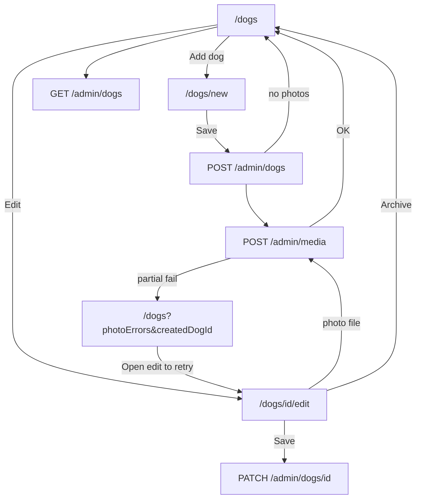

# AUDIT: Admin Dogs (сводный)

Дата: 2026-08-04

**Статус:** исправления из раздела «Рекомендуемый порядок fix» реализованы — см. `REPORT.md`.

Папка: `tasks/2026-08-04-dogs-create-photos/`

Объединяет два запроса:
1. Повторный аудит admin Dogs + взаимосвязи (после redirect create → `/dogs`)
2. Целевая проверка: **Edit → Save «ничего не происходит»**

**Правок в коде нет.** Документ для review перед «делай».

---

## Методология

| Источник | Что делали |
|----------|------------|
| Код | `DogForm`, `/dogs`, `/dogs/new`, `/dogs/[id]/edit`, `api.ts`, backend dogs/media |
| API live | `localhost:4000` — create, PATCH, upload, list, archive, validation |
| Browser | `/dogs`, `/dogs/.../edit` — клик Save, вкладки EN/TH |
| Backend e2e | 54/54 passed (dogs PATCH — только API, не UI) |
| Admin e2e | **нет** |

Dev-БД: **~138–147 собак** (e2e/ручной мусор).

---

## Карта взаимосвязей (актуальный код)



| Связь | Статус (API/код) |
|-------|------------------|
| Create без фото → `/dogs` | OK |
| Create + photos OK → `/dogs` | OK |
| Partial upload → list + banner + link edit | OK (код) |
| List → Edit → PATCH | OK (API) |
| List → Edit → upload → GET media | OK (API) |
| Archive → excluded from Active list | OK (API) |
| Create без EN description | 400 (API) |

---

## Что уже исправлено (ранние итерации)

| Было | Сейчас |
|------|--------|
| Список без пагинации | Page 20, filter Active, search slug |
| Фото только после Save на new | Variant A: multi-file + upload после create |
| Stale preview после upload edit | reload родителя, без stale `setMedia` |
| th/ru validation 400 | Optional DTO + `sanitizeDescriptions()` |
| Archive без confirm/errors | Confirm + error banner |
| STAFF видит Content/Users | Nav по роли |
| Redirect create → edit | **Изменено:** redirect → **`/dogs`** |
| «Не возвращает на список собак» | **Закрыто** redirect на `/dogs` |

---

## Edit → Save «ничего не происходит» (целевая проверка)

### Было ли в прошлом аудите?

**Нет, не как отдельная находка про Edit Save.**

- API `PATCH` проверялся — работает.
- «Edit flow не сломан» — вывод **по коду**, без UI-клика Save.
- Баг `required={tab === 'en'}` упоминался, но как риск 400 от API, не как «кнопка молчит».
- **Admin e2e на кнопку Save нет.**

### Что показала проверка сейчас

| Симптом | Причина | Запрос в API? |
|---------|---------|---------------|
| Save — **вообще** ноль реакции | EN tab + пустые Name/Description → **HTML5 block** | **Нет** |
| «Saving…» мелькнуло — и тишина | Save **работает**, **нет success feedback** | **Да** |
| Поменял текст, Save — «ничего» | Форма показывает те же значения после save | **Да** (выглядит как no-op) |

**Browser:** Edit → Save → кнопка «Saving…» → «Save», страница та же, **нет** баннера успеха/ошибки (при 200).

**Код edit save** (`edit/page.tsx:54–58`):

```ts
const updated = await updateDog(token, params.id, payload);
setDog(updated);
// нет toast, redirect, «Saved»
```

**Корень UX:** сохранение есть, **подтверждения для пользователя нет**.

**Корень «молчаливого» блока:** `DogForm.tsx` — `required={tab === 'en'}` только на активной вкладке; пустые EN-поля + EN tab → native validation без app-error.

---

## Все оставшиеся неисправности (единый список)

### Критичные

| # | Проблема | Где | Риск |
|---|----------|-----|------|
| C1 | **Edit Save — нет feedback** | `edit/page.tsx`, `DogForm` | Пользователь считает Save сломанным |
| C2 | **Double Save на `/dogs/new`** | `DogForm` finally + `router.push` | Дубликаты собак |
| C3 | **EN required только на EN tab** | `DogForm.tsx:268,281` | HTML5 block или 400 — «Save не работает» |
| C4 | **Presigned URL 15 min** | backend media | Превью на edit «пропадают» |
| C5 | **Dev-БД 140+ dogs** | data | luna/mango теряются без search |

### Средние

| # | Проблема | Где |
|---|----------|-----|
| M1 | BRIEF/REPORT устарели (redirect edit vs `/dogs`) | `tasks/.../BRIEF.md`, `REPORT.md` |
| M2 | Два канала `photoErrors` (list + edit legacy) | `dogs/page.tsx`, `edit/page.tsx` |
| M3 | Banner `photoErrors` ненадёжен в Strict Mode (dev) | query + `router.replace` |
| M4 | После create на list — нет «Dog created» | `/dogs` |
| M5 | List не показывает фото — проверка только через Edit | UX после create |
| M6 | Upload не bump `dog.updatedAt` | новая собака может не быть первой в list |
| M7 | Edit upload: нет validation/loading | vs create mode |
| M8 | Create: file input не disabled при Save/upload | |
| M9 | `file.type === ''` на Windows | create mode reject |
| M10 | Partial fail: «some photos» при total fail; нет имён файлов | `new/page.tsx` |

### Мелкие

| # | Проблема |
|---|----------|
| L1 | `AdminHeader` всегда «Sign in» |
| L2 | Мёртвая ветка UI «redirected to edit» в `DogForm` |
| L3 | SEO пустые строки в payload |
| L4 | Нет admin e2e |
| L5 | Seed dogs без media |
| L6 | `photoErrors` в URL — длина, `;` в тексте |

---

## Матрица регрессий (перед fix)

| Меняем | Затронет |
|--------|----------|
| Edit success/error UX | Save, user trust |
| `DogForm` validation | Create + Edit |
| `DogForm` loading/submit guard | Create duplicates + Edit |
| `new/page.tsx` redirect | List banner |
| `dogs/page.tsx` query | Partial upload UX |
| BRIEF/REPORT | Документация harness |

---

## Live-тесты (выполнены)

```
CREATE en-only              OK
LIST page1 contains new dog True
UPLOAD + GET media count 1  OK
PATCH update                OK
SEARCH slug                 OK
VALIDATION no EN desc       400
ARCHIVE + exclude Active    OK
Backend e2e                 54/54
Browser Edit Save           Saving… → Save, no success UI
Browser EN tab empty save   (HTML5 block — no network)
```

**Не проверено live:** MinIO down, duplicate slug UI, STAFF archive UI, полный create+photos UI end-to-end.

---

## Рекомендуемый порядок fix (для обсуждения)

1. **Edit Save feedback** — success banner «Saved» / error (главная жалоба)
2. **EN validation** — JS check до submit, независимо от tab
3. **Double submit guard** — create (и edit при необходимости)
4. **Обновить BRIEF/REPORT** под redirect `/dogs`
5. **`photoErrors`** — sessionStorage вместо query (Strict Mode)
6. Create success toast на list
7. Edit upload parity с create (validation + loading)
8. Presigned refresh — отдельная задача

---

## Критерии «готово к merge» (предложение)

- [ ] Edit: Save → видимый success или error
- [ ] Edit: Save с Thai tab и пустым EN → понятная ошибка в UI
- [ ] New: повторный Save не создаёт дубликат
- [ ] Create + photos → `/dogs`, partial fail → banner + link edit
- [ ] `npm run build -w dogrsc-admin` OK
- [ ] Backend dogs e2e OK
