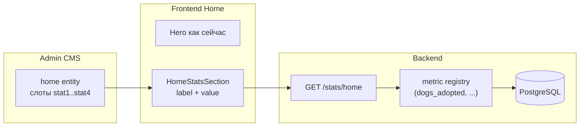

# BRIEF: Home — блок счётчиков (impact stats)

Дата: 2026-08-07

Папка задачи: `tasks/2026-08-07-home-stats/`

## Формулировка

На главной странице под hero добавить **блок из 3–4 счётчиков** вроде «Мы помогли **42** собакам», «**12** собак ищут дом». Числа должны быть **подключаемыми**: admin выбирает, какие метрики показывать и с каким текстом; значения берутся из БД (или baseline + авто).

Цель этой итерации — **проработка и безопасное внедрение**, без поломки текущего home/CMS.

## Контекст

| Сейчас | Проблема |
|--------|----------|
| Home = hero + 4 CTA (`content` entity `home`, 5 полей) | Нет социального доказательства / цифр доверия |
| Admin dashboard уже считает dogs/reports/donations | Логика дублируется только в admin, публично недоступна |
| CMS Content — фиксированные поля на страницу | Нужен паттерн «слот счётчика», как FAQ (5 слотов), но с привязкой к метрике |

## Принцип «без вреда»

1. **Только additive changes** — существующие поля `home` не трогаем.
2. **Graceful degradation** — если API stats недоступен или все слоты выключены, home выглядит как сейчас.
3. **Opt-in через CMS** — по умолчанию блок скрыт (`statsSectionEnabled = false` в seed).
4. **Отдельный public endpoint** — не расширяем admin dashboard наружу.
5. **Фазирование** — сначала MVP (фиксированные слоты + registry метрик), потом при необходимости полноценный CRUD счётчиков.

## Рекомендуемая архитектура (MVP)



### Слой 1 — Public API (новый)

**`GET /api/v1/stats/home`** (`@Public()`)

Возвращает объект со **всеми** зарегистрированными метриками (числа). Frontend/CMS решают, что показывать.

```json
{
  "dogsAdopted": 0,
  "dogsInCare": 1,
  "dogsAvailable": 1,
  "donationsConfirmedTotal": 1500,
  "donationsConfirmedMonth": 1000,
  "reportsActive": 2,
  "storiesPublished": 3
}
```

- `revalidate: 60` на frontend (как dogs/stories).
- Один запрос, без N+1.

### Слой 2 — CMS config (расширение entity `home`)

Новая группа полей **Home stats** (4 слота × ~4 поля):

| Поле | Тип | Назначение |
|------|-----|------------|
| `statsSectionEnabled` | bool (строка `true`/`false`) | Показать блок целиком |
| `statsSectionTitle` | text | Заголовок секции (optional) |
| `statNEnabled` | bool | Включить слот N |
| `statNMetric` | enum key | `dogs_adopted`, `dogs_in_care`, … |
| `statNLabel` | text | Шаблон с `{value}`: «Мы помогли {value} собакам» |
| `statNOffset` | number (optional) | Ручной baseline до CRM, прибавляется к авто-числу |

Admin редактирует через существующий **`/content` → Home hero** (manifest расширяется).

### Слой 3 — Frontend

- Компонент `HomeStatsSection` под hero.
- Парсит CMS-слоты + подставляет `{value}` из API.
- Форматирование чисел: `toLocaleString(locale)`; для сумм donations — optional `{value}` в THB без копеек.
- i18n fallback в `messages/home` для label/enabled по умолчанию.

## Registry метрик (MVP)

| Key | SQL / смысл | Для UI |
|-----|-------------|--------|
| `dogs_adopted` | `dog.status = ADOPTED` | «Нашли дом» |
| `dogs_in_care` | `status = IN_CARE` | «На попечении» |
| `dogs_available` | `status = AVAILABLE AND isPublished = true` | «Ищут дом» (публичная витрина) |
| `donations_confirmed_total` | sum `amount` where `CONFIRMED` | «Собрано пожертвований (THB)» |
| `donations_confirmed_month` | sum CONFIRMED, текущий UTC month | «За этот месяц» |
| `reports_active` | found+lost where status IN (ACTIVE, VERIFIED) | «Активных обращений» |
| `stories_published` | `story.isPublished = true` | «Историй спасения» |

**«Мы спасли N собак»** в MVP = `dogs_adopted + statNOffset` (offset для исторических спасений до системы).

## Открытые вопросы (нужно утвердить)

| # | Вопрос | Рекомендация MVP |
|---|--------|------------------|
| 1 | Сколько слотов? | **4** (как FAQ) |
| 2 | Авто vs ручное значение | **Авто из БД + optional offset**; чисто ручной режим — Phase 2 |
| 3 | «Спасли» = adopted или in_care+adopted? | **`dogs_adopted`**; offset для «всего за 10 лет» |
| 4 | Donations на публике | **Только сумма CONFIRMED** (без PENDING); показывать ли — решает admin слотом |
| 5 | Где настраивать | **CMS `/content` home** (не отдельный admin CRUD) |
| 6 | Default при seed | **Блок выключен**; demo: 3 слота enabled после явного seed update |
| 7 | Dashboard refactor | **Не трогаем** dashboard в MVP; общий `StatsService` — optional follow-up |

## Scope

### Включено (Phase 1)

- Backend: `StatsModule`, `GET /stats/home`, e2e
- CMS manifest + seed для home stats fields
- Frontend: `HomeStatsSection`, расширение home page
- i18n fallback keys
- Seed demo: section off by default OR 3 demo counters (по решению)

### Не включено

- Отдельная таблица `SiteCounter` / CRUD в admin
- Анимация count-up при scroll
- Графики, trends, кэш Redis
- Изменение dashboard admin
- Footer / about stats

## Утверждённые решения (2026-08-07)

- **4 слота** счётчиков
- «Спасли» = `dogs_adopted` + offset
- **Donations на публике — нет** (метрики не в API)
- Seed: блок **выключен** по умолчанию
- UI: **крупное число + подпись снизу**

## Критерии успеха

- [x] Home без включённых stats выглядит как до изменений
- [x] При включении в CMS — блок с корректными числами en/th/ru
- [x] offset работает для adopted
- [x] Public endpoint без auth; donations не отдаются
- [x] `npm run build` + e2e stats
- [x] Seed/migration не ломает существующий content
